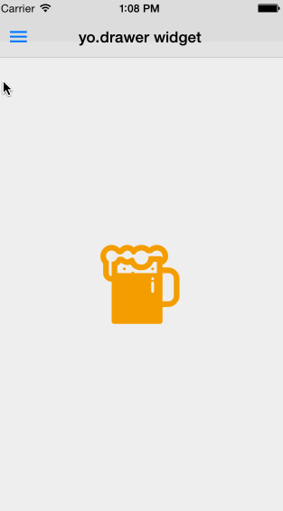
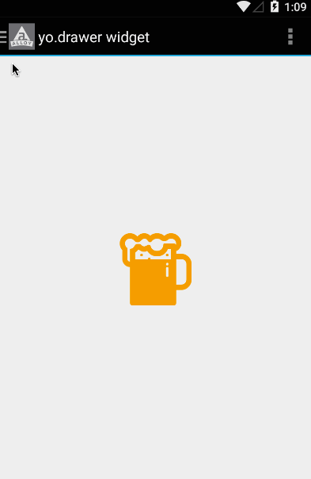

## DrawerLayout
This is a Alloy drawer widget for **Android drawerLayout style**.  
I got a lot of ideas and hints from [@FokkeZB's drawer](https://github.com/FokkeZB/nl.fokkezb.drawer). Thanks  @FokkeZB. :)  
On Android, this works as a wrapper of [Ti.DrawerLayout](https://github.com/manumaticx/Ti.DrawerLayout) Android module. Thanks @Tripvi and @manumaticx.  
On iOS, this works using pure Titanium API.

ios | androd
--- | ------
 | 

## Why use this?
I want to make it simple and use `leftNavButton`, `rightNavButton`, `Menu`, `ActionBar` on xml directly even using drawer.

## Usage
1. Install the [Ti.DrawerLayout](https://github.com/manumaticx/Ti.DrawerLayout)
Unfortunately, latest version of Ti.DrawerLayout not avaliable on gitt.io. Because original version of this module was stopped to maintain. You can download [@manumaticx version](https://github.com/manumaticx/Ti.DrawerLayout/tree/master/dist).
1. Install this widget via gitTio:
```
gittio install kr.yostudio.drawer
```
1. In your xml, use like below code. You have to set one `leftView` and one `centerWindow`

#### xml
```xml
<Alloy>
	<Widget src="kr.yostudio.drawer"
    	onDraweropen="onDrawerOpen"
		onDrawerclose="onDrawerClose">
		<View class="menuWrap" role="leftView">
			<Require id="menuC" src="menu">
			</Require>
		</View>
		<Window platform="ios" role="centerWindow" title="yo.drawer widget">
			<LeftNavButton>
				<View>
					<Button  class="ion-android-menu menuBtn" onClick="onMenuButtonClick"/>
				</View>
			</LeftNavButton>
			<Require src="main" id="mainC">
			</Require>
		</Window>
		<Window platform="android" role="centerWindow">
		    <ActionBar onHomeIconItemSelected="onMenuButtonClick" title="yo.drawer widget" ></ActionBar>
			<Menu>
				<MenuItem id="item1" title="Settings"/>
				<MenuItem id="item2" title="Search"/>
			</Menu>
			<Require src="main" id="mainC">
			</Require>
		</Window>
	</Widget>
</Alloy>
```

#### js
```javascript
function onMenuButtonClick(e){
    $.index.toggleLeftView();
}

function onDrawerOpen(e) {
    Ti.API.info($.index.isLeftDrawerOpen);
}

function onDrawerClose(e) {
    Ti.API.info($.index.isLeftDrawerOpen);
}

function onDrawerSlide(e) {
    // slide offset: e.offset
    console.log(e);
}

$.menuC.on('menuclick',function(e){
    $.index.toggleLeftView({animated:false}); //animated option only work on ios
    if(e.itemId == 'smile'){
        $.index.openWindow(Alloy.createController('smile').getView());
    }else{
        $.index.openWindow(Alloy.createController('cry').getView());
    }
});

$.index.open();
```
## Method 
Name | Description
---- | -----------
toggleLeftView | Toggle left drawer open status
openWindow | openWindow on Navigation window (On Android, just open new window)

## Event
Name | Description
---- | -----------
draweropen | Fired after drawer opened
drawerclose | Fired after drawer closed
~~drawerslide~~ | ~~Fired while drawer is sliding~~

## To do
This is a very first version. Welcome to any suggest and any PR.
- Add changeCenterView method as a widget method.
- Add `drawerslide` event

## License
MIT
